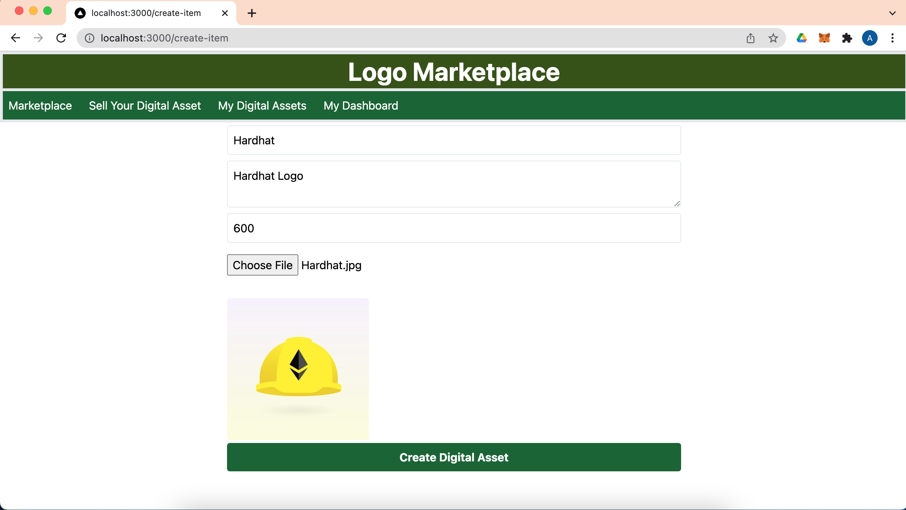
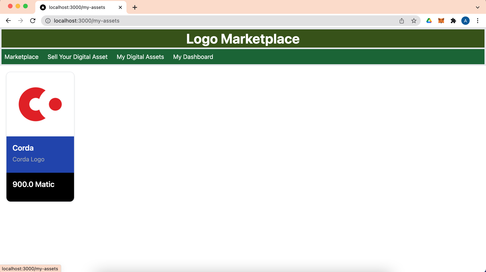
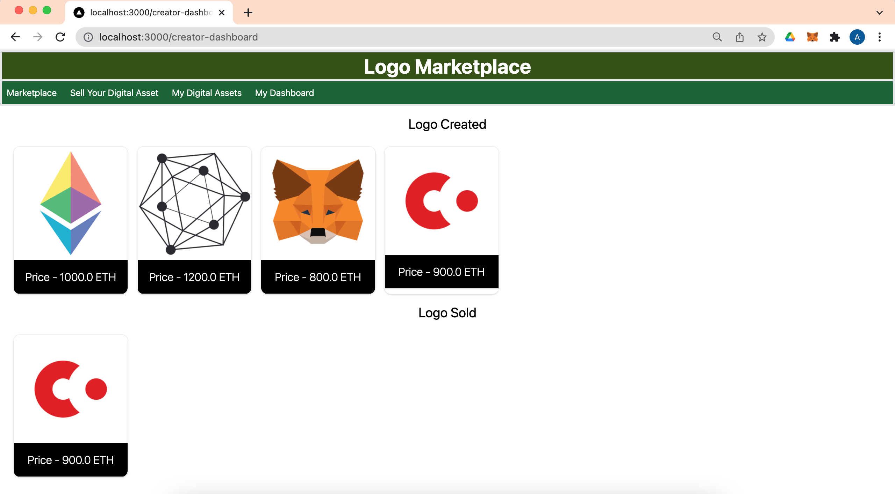

# NFT Logo Markteplace dApp

This is a distributed application (dApp) for NFT Logo Marketpace. In this application users can publish their Logo creativity / digital assets for sale. 

**Marketplace : Buy Logo!**


**Sell Your Logo!**


**Logos You Own!**


**Your Dashboard**


This is end-to-end blockchain distributed application. We are using following technology stack for this dApp

- [Hardhat](https://hardhat.org) : Blockchain development environment.
- [Solidity](https://soliditylang.org) : Smart Contracts
- [MetaMask](https://metamask.io) : Wallet
- [Web3Modal](https://github.com/Web3Modal/web3modal) : Web3 library to connect to wallets (MetaMask)
- [IPFS](https://ipfs.io) : NFT matadata storage
- [next.js](https://nextjs.org) : Front-end for dApp
- [chai.js](https://www.chaijs.com) : testing framework
- [tailwindCSS](https://tailwindcss.com) : CSS 
- [yarn](https://yarnpkg.com) : Packager Manager
- [git](https://git-scm.com/) : Version Control
- [node.js](https://nodejs.org/en/) : JavaScript Runtime

## Environemnt Setup

- Install Node.js > 12.x (https://nodejs.org/en/download/)
 
- Install Git (https://git-scm.com/downloads)
 
- Install Hardhat: create application root folder and run following command from *app-root*

```
npm install --save-dev hardha
```

- Install Solidity compiler : run following command. This is global installation

```bash
npm install -g solc
```

- Install Metamask (doesn't support Safari, use Chrome) : https://metamask.io/download/


## Project Setup


- Create Next.js Project

```bash
npx create-next-app nft-marketplace
```

- Add Prod dependencies

```bash
yarn add ethers hardhat @nomiclabs/hardhat-waffle ethereum-waffle chai @nomiclabs/hardhat-ethers web3modal @openzeppelin/contracts ipfs-http-client axios
```

- Add Dev Dependencies

```
yarn add -D tailwindcss@latest postcss@latest autoprefixer@latest
```

- Initialize tailwind

```bash
npx tailwindcss init -p

Created Tailwind CSS config file: tailwind.config.js
Created PostCSS config file: postcss.config.js
$ > 
```

- Initialize hardhat project

```bash
npx hardhat 
```

- Update hardhat.config.js with network details


- Create Smart Contracts


- Setup MetaMask, create and account, export proivate key, store it in ".secret" file and use in hardhat config file


- Run the hardhat node

```bash
npx hardhat node
```

- Deploy Smart Contracts

```bash
npx hardhat run scripts/deploy.js --network localhost
NFTMarket deployed to: 0xe7f1725E7734CE288F8367e1Bb143E90bb3F0512
NFT deployed to: 0x9fE46736679d2D9a65F0992F2272dE9f3c7fa6e0
$ > 
```

- Update contract address in config.js file

- Run front-end

```bash
npm run dev
```


